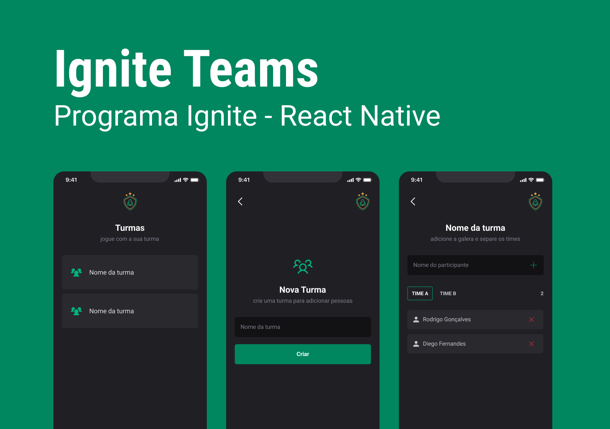

<h1 align="center"> ignite teams </h1>

APP desenvolvido na trilha de React Native

  <a href="#-tecnologias">Tecnologias</a>&nbsp;&nbsp;&nbsp;|&nbsp;&nbsp;&nbsp;
  <a href="#-projeto">Projeto</a>&nbsp;&nbsp;&nbsp;|&nbsp;&nbsp;&nbsp;
  <a href="#-layout">Layout</a>&nbsp;&nbsp;&nbsp;|&nbsp;&nbsp;&nbsp;
  <a href="#-layout">Executando</a>&nbsp;&nbsp;&nbsp;|&nbsp;&nbsp;&nbsp;
  <a href="#memo-licença">Licença</a>

  

  

 

## 🚀 Tecnologias

Esse projeto foi desenvolvido com as seguintes tecnologias:

- Reac Native
- Git e Github
- TypeScript
- Styled-Components
- Async Storage

## 💻 Projeto

O objetivo do projeto é criar um app que seja possível cadastrar turmas e dentro das turmas incluir pessoas para time 1 e time 2 com a finalidade desses times se enfrentarem em qualquer tipo de esporte.

## 💅🏻 Layout

<a href="https://www.figma.com/design/TlunbPcxufbGxzHv5nbOFW/Ignite-Teams-(Community)?node-id=47-273&node-type=CANVAS&m=dev">Layout</a>

## 🛠️ Telas

### lista de Turmas

### Cadastro de Turmas

### Participantes

## :memo: Licença

Esse projeto está sob a licença MIT.

---
